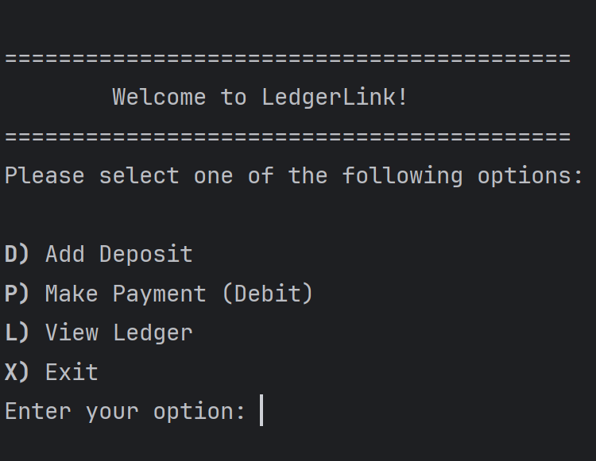
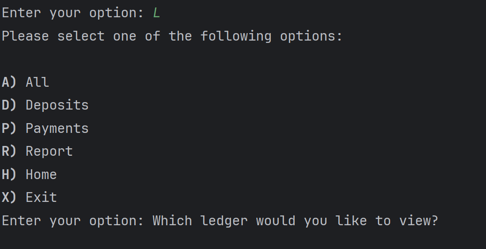
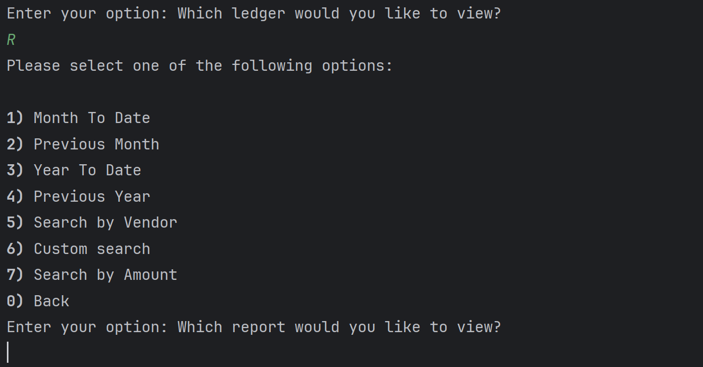
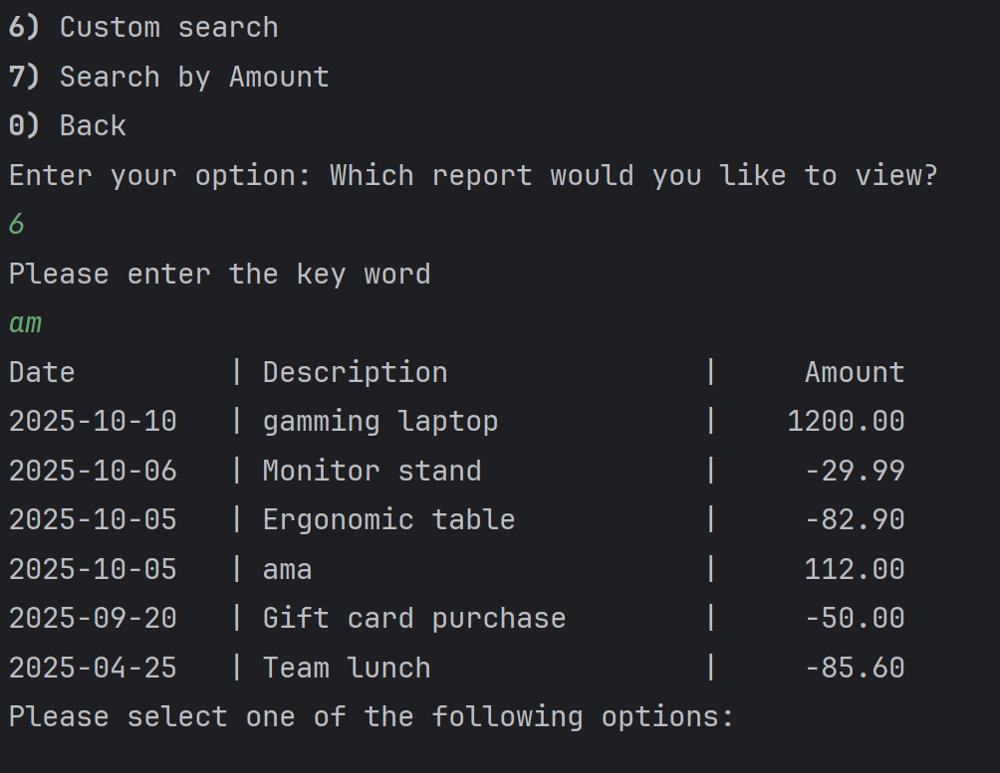
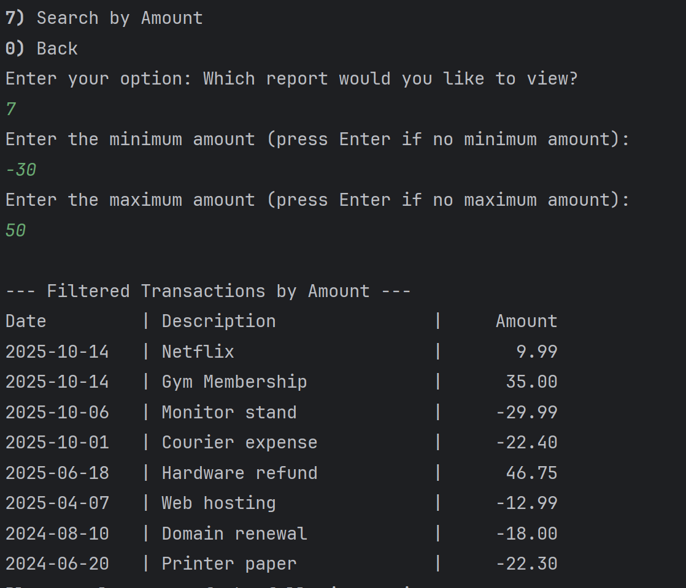
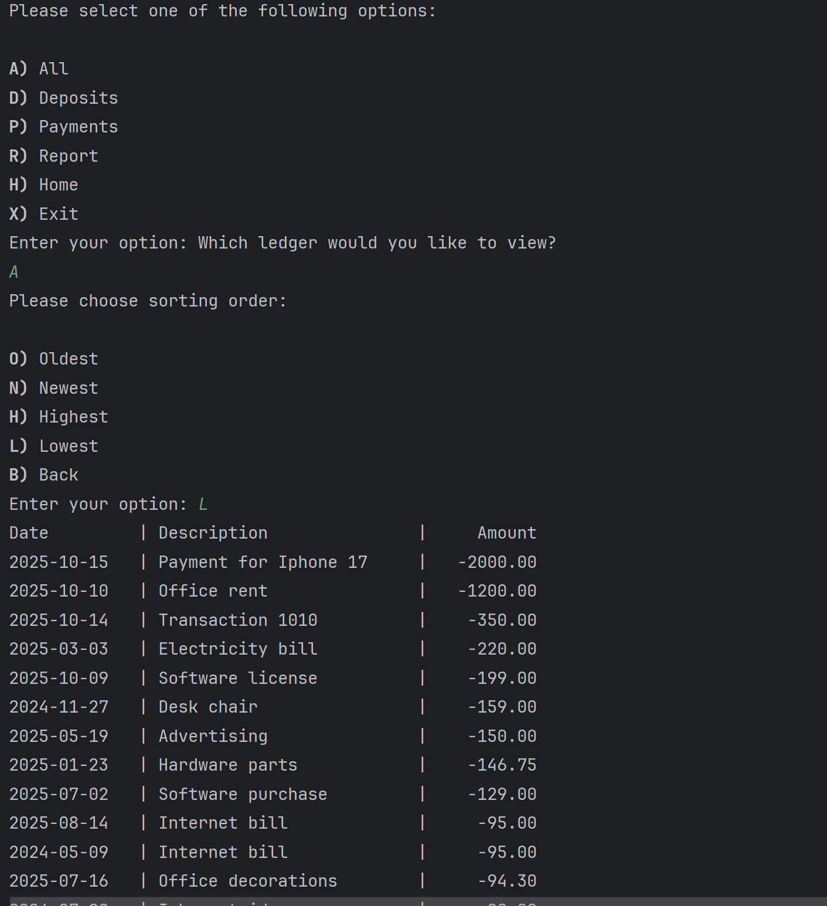

# 💼 LedgerLink - Java CLI Accounting Ledger

LedgerLink is a command-line Java application that allows users to track financial transactions such as deposits and payments, view ledger entries, and generate reports. This project was built as part of a Java development capstone and demonstrates core Java skills including file I/O, object-oriented design, enums, and user input handling.

---


## 📦 Features

- ✅ Add deposits and make payments
- ✅ View all transactions, deposits only, or payments only
- ✅ Generate reports:
    - Month-To-Date
    - Previous Month
    - Year-To-Date
    - Previous Year
    - Search by Vendor
    - Custom Search (filter by any field)
- ✅ Sort transactions by:
    - Newest
    - Oldest
    - Highest amount
    - Lowest amount
- ✅ Input validation and error handling
- ✅ Modular design using enums and helper classes
---

## 🖥️ Screens

### 1. Home Screen


### 2. Leger Menu


### 3. Report Menu


### 4. Custom Search


### 5. Filter By Amount


### 6. Display All Leger In Customised Sort


---

## 🧠 Interesting Code Snippet

This code help the user to enter only a valid and correct input and prevents from crashing:

```java
public static double readDouble(Scanner scanner1 , String message){
        while (true){
            System.out.print(message);
            String input = scanner1.nextLine();
            try{
                return Double.parseDouble(input);
            }catch (NumberFormatException e){
                System.out.println("❌ Invalid number! Please enter a valid value.");
            }
        }
    }
    
public static double validateAmount(double amount, boolean shouldBePositive){
    while (true){
        if(shouldBePositive && amount > 0){//verifies if deposit and mount is not negative
            return amount;
        } else if (!shouldBePositive && amount < 0) {//verifies if payment and amount is not positive
            return amount;
        }else{
            System.out.println(shouldBePositive?"❌ Invalid input. Please enter a positive amount. ":"❌ Invalid input. Please enter a negative amount. ");
            amount = readDouble(scanner, "Enter amount again: ");;
        }
    }
}
```

This method convert a user’s input string (like "a" or "D") into the corresponding enum value
```java
public static LegerMenuOptions fromString(String input){
        if(input == null) return null;
        input = input.trim().toUpperCase();
        for (LegerMenuOptions option : values()){
            if(option.code.equals(input)){
                return option;
            }
        }
        return null; // invalid option
    }
```

Comparator and sort makes my code clean and well functional
```java
switch (option){
            case OLDEST -> transactions.sort(
                    Comparator.comparing((transaction -> transaction.getDate().atTime(transaction.getTime())))
            );
            case NEWEST -> transactions.sort(
                    Comparator.comparing((Transaction transaction) -> transaction.getDate().atTime(transaction.getTime()))
                            .reversed()
            );
            case HIGHEST -> transactions.sort(
                    Comparator.comparing(Transaction::getAmount).reversed()
            );
            case LOWEST -> transactions.sort(
                    Comparator.comparing(Transaction::getAmount)
            );
            case BACK -> Ledger.legerOperation();
        }
```

# 📁 File Structure
```text
src/
├── main/
│   ├── java/pluralsight/
│   │   ├── Main.java
│   │   ├── HomeScreen.java
│   │   ├── Deposits.java
│   │   ├── Ledger.java
│   │   ├── Reports.java
│   │   ├── Transaction.java
│   │   ├── Sorting.java
│   │   ├── enums/
│   │   │   ├── MainMenuOptions.java
│   │   │   ├── LegerMenuOptions.java
│   │   │   ├── SortOption.java
│   └── resources/
│       └── transactions.csv
```

---

## 🚀 How to Run

1. **Clone the repository**:
   ```bash
   git clone https://github.com/Estif017/LedgerLink.git
    ```

2. **Open the project**: in your preferred Java IDE (e.g., IntelliJ IDEA, Eclipse, VS Code).
3. **Navigate**: to Main.java in the src/main/java/pluralsight/ directory.
4. **Run the application.**

---

## 🙌 Author
## Estifanos Teklearegay
### Capstone Project – Java Development Fundamentals
### GitHub: https://github.com/Estif017
